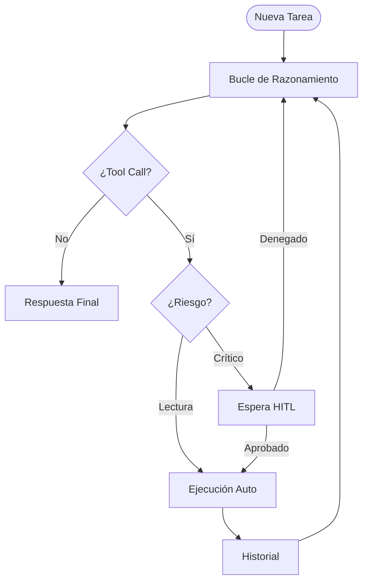
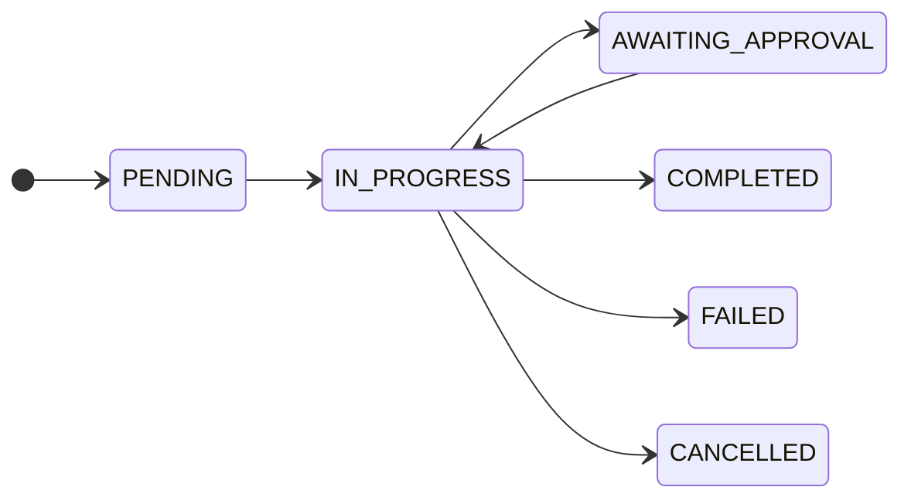

# Arquitectura del Sistema

## 1. Visión general

Agente LLM con bucle ReAct, HITL, persistencia SQLite y UI tkinter. Cero dependencias externas en tiempo de ejecución (excepto `llama-cpp-python` opcional).

## 2. Diagrama de flujo



### 2.1. Mecanismo de forzado de herramientas (3 strikes)

1. Primera iteración sin `tool_calls`: `tool_choice="auto"`.
2. Segunda: `tool_choice="required"`.
3. Tercera: recordatorio explícito en el historial.
4. Cuarta: se acepta el contenido como respuesta final.

## 3. Componentes principales

### A. Motor del Agente (LLM & Tools)

Soporta dos modos:

| Modo | Descripción | Dependencia |
|---|---|---|
| `local` | GGUF con `llama-cpp-python` | `llama-cpp-python` |
| `http` | Endpoint compatible OpenAI | Ninguna |

**Parser dual:** soporta `message.tool_calls` (OpenAI nativo) y bloques `<tool_call>{...}</tool_call>` en texto plano.

### B. Gestor de Permisos (HITL)

- Acciones seguras → ejecución automática.
- Acciones críticas → pausa con `AWAITING_APPROVAL` hasta decisión humana.
- Timeout: 10 minutos (denegación automática).

### C. Estados de tarea



### D. Persistencia

- SQLite nativo con FK `ON DELETE CASCADE`.
- Índices en `task_id` y `status`.
- Thread-safety con `threading.Lock` y timeout de 10s.
- Limpieza de tareas `PENDING`/`IN_PROGRESS` al arrancar.

## 4. Mecanismos de resiliencia

- **Regla de 3 strikes** para forzar uso de herramientas.
- **Detección de bucles** con `loop_threshold` y compactación de contexto.
- **Parser dual** (OpenAI nativo + bloques `<tool_call>`).
- **Normalización de argumentos** malformados.
- **Captura global de excepciones** en el bucle del agente.

## 5. Modelo de datos

```sql
CREATE TABLE tasks (
    id INTEGER PRIMARY KEY,
    title TEXT,
    prompt TEXT,
    status TEXT,
    created_at TEXT,
    updated_at TEXT
);

CREATE TABLE history (
    id INTEGER PRIMARY KEY,
    task_id INTEGER REFERENCES tasks(id) ON DELETE CASCADE,
    event_type TEXT,
    content TEXT,
    created_at TEXT
);
```

## 6. Herramientas

### Seguras

- `read_file(path)`
- `list_directory(path?)`
- `search_files(pattern, path?)`
- `get_current_time()`

### Críticas (HITL)

- `write_file(path, content)`
- `execute_command(command)`
- `delete_file(path)`

### Restricciones

- Workspace restringido (path traversal bloqueado).
- Denylist: `rm -rf /`, `format`, `del /f /s /q`, `shutdown`, `reboot`.
- Timeout de comandos: 30s.
- Truncado: 50 KB archivos, 20 KB comandos, 200 coincidencias búsquedas.
