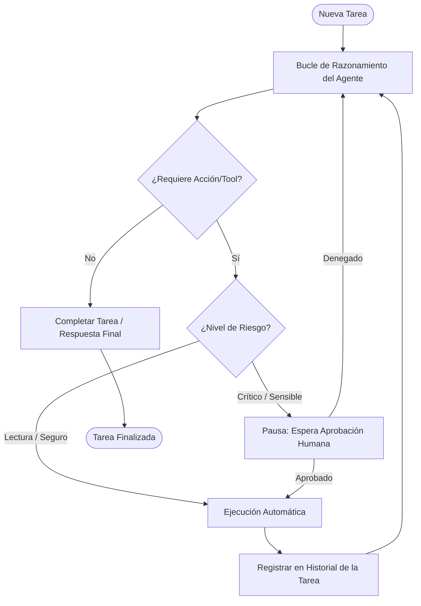
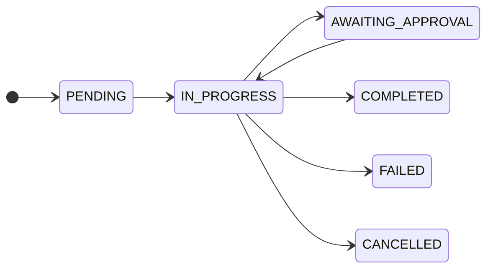
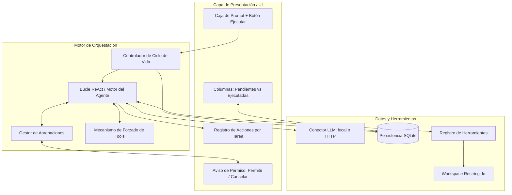

# Arquitectura de Alto Nivel: Agente LLM Autónomo con Control de Permisos (HITL)

## 1. Visión y Propósito

El objetivo es construir un sistema de ejecución de tareas basado en un Agente con LLM desarrollado **exclusivamente con la biblioteca estándar de Python** (cero dependencias externas en tiempo de ejecución; `llama-cpp-python` solo se requiere opcionalmente para el modo local).

El sistema proporciona:

- **Gestión del ciclo de vida de tareas** (`PENDING`, `IN_PROGRESS`, `AWAITING_APPROVAL`, `COMPLETED`, `FAILED`, `CANCELLED`).
- **Control de seguridad humano (*Human-in-the-Loop*):** Validación y aprobación manual de acciones sensibles antes de su ejecución.
- **Trazabilidad completa:** Historial estructurado y auditable de cada paso, diferenciado por tarea seleccionada.
- **Interfaz de Usuario / Dashboard interactivo:** Panel de control para el ingreso de instrucciones, monitorización de tareas, revisión del historial de ejecución y autorización de operaciones críticas.
- **Persistencia local en SQLite** con borrado en cascada y limpieza automática al arrancar.
- **Resiliencia ante respuestas malformadas del modelo** (tool_calls incorrectos, JSON inválido, nombres inexistentes, argumentos con tipos incorrectos, etc.).

---

## 2. Diagrama Conceptual del Flujo de Trabajo



### 2.1. Mecanismo de Forzado de Herramientas

Para evitar que el modelo ignore las herramientas disponibles (común en modelos pequeños o mal ajustados), el agente aplica una **regla de 3 strikes**:

1. Primera iteración sin `tool_calls`: `tool_choice="auto"` (el modelo decide).
2. Segunda iteración sin `tool_calls`: `tool_choice="required"` (fuerza al menos una llamada).
3. Tercera iteración sin `tool_calls`: se inyecta un **recordatorio explícito** en el historial.
4. Cuarta iteración sin `tool_calls`: se acepta el contenido como respuesta final.

Una vez que el modelo usa herramientas al menos una vez, cualquier respuesta posterior sin `tool_calls` se acepta inmediatamente como respuesta final.

---

## 3. Pilares del Sistema

### A. Motor del Agente (LLM & Tools)

El sistema soporta **dos modos de operación del LLM**, seleccionables desde `config.ini` o variables de entorno:

| Modo | Descripción | Dependencia externa |
|------|-------------|---------------------|
| `local` | Carga un modelo GGUF directamente con `llama-cpp-python` (inferencia en proceso, sin endpoint HTTP). | `llama-cpp-python` |
| `http` | Envía solicitudes a un endpoint compatible con `/v1/chat/completions` (OpenAI, Ollama, llama.cpp server). | Ninguna |

Ambos modos devuelven respuestas en formato compatible con OpenAI (`choices[0].message.content` / `tool_calls`), por lo que el parser funciona sin cambios.

**Soporte de doble formato de tool_calls:**

- **Estructurado OpenAI:** campo `message.tool_calls` (lista de objetos).
- **Texto plano:** bloques `<tool_call>{...}</tool_call>` dentro de `message.content` (común en Qwen3-Instruct y modelos que no usan el formato nativo).

El parser detecta automáticamente ambos formatos y normaliza los argumentos (JSON inválido → `_raw`; tipos incorrectos → `{}`).

### B. Gestor de Permisos y Seguridad (HITL)

- **Acciones Seguras (Lectura):** Se ejecutan de manera desatendida.
- **Acciones Críticas (Escritura / Comandos):** Bloquean la tarea en estado `AWAITING_APPROVAL` hasta que el usuario confirma ("Permitir") o rechaza ("Cancelar") la operación.
- **Timeout de aprobación:** 10 minutos. Si el usuario no responde, la acción se deniega automáticamente.
- **Notificación visual:** sonido del sistema (`bell()`) al aparecer una solicitud.

### C. Estados de Tarea



**Limpieza al arrancar:** al iniciar la aplicación, se eliminan automáticamente las tareas en estado `PENDING` o `IN_PROGRESS` que pudieran haber quedado registradas por un cierre brusco o fallo en una sesión anterior.

### D. Trazabilidad y Persistencia

- Almacenamiento local estructurado (SQLite nativo).
- Separación de registros por tarea: seguimiento cronológico de pensamientos, llamadas a herramientas, decisiones de permisos y resultados.
- **Borrado en cascada:** al eliminar una tarea, su historial se borra automáticamente (FK con `ON DELETE CASCADE`).
- **Índices** en `task_id` y `status` para consultas eficientes.
- Conexiones thread-safe con `threading.Lock` y timeout de 10s.

---

## 4. Especificación Detallada de la Interfaz de Usuario (UI)

La interfaz se estructura de forma jerárquica y modular en **cuatro zonas principales**, con un sistema de prioridad que garantiza que el prompt y el panel de aprobación estén siempre visibles aunque la ventana se reduzca verticalmente.

### 4.1. Zona Superior: Entrada y Creación de Tareas (SIEMPRE VISIBLE)

- **Caja de Prompt:** Campo de entrada de texto multilínea (Text Area) donde el usuario redacta la instrucción completa o el objetivo que debe cumplir el agente.
- **Botón de Ejecución:** Botón interactivo etiquetado como `▶ Ejecutar`. Al pulsarlo, crea la tarea, la registra en la base de datos con estado `PENDING` e inicia el bucle de razonamiento del agente en un hilo separado.
- **Botón `🧹 Limpiar`:** Vacía el contenido del prompt.
- **Etiqueta de configuración:** Muestra el modo LLM activo, modelo, endpoint y ruta del workspace.

### 4.2. Zona Media: Tablero de Tareas (Disposición en 2 Columnas)

- **Columna Izquierda (Tareas Pendientes y en Ejecución):**
  - Lista interactiva con scroll vertical que contiene las tareas en estados `PENDING`, `IN_PROGRESS` y `AWAITING_APPROVAL`.
  - Muestra identificador (`#N`), estado coloreado y título resumen.
  - Botón `Ver` para seleccionar la tarea y visualizar su actividad en tiempo real.
- **Columna Derecha (Tareas Ejecutadas / Históricas):**
  - Lista de tareas finalizadas en estados `COMPLETED`, `FAILED` o `CANCELLED`.
  - Al hacer clic sobre un elemento, carga en el panel inferior todo el histórico inmutable de dicha tarea.
- **Altura fija** (420 px) para evitar que el tablero crezca indefinidamente y desplace los controles críticos fuera de la pantalla.

### 4.3. Zona Inferior: Registro de Trazabilidad

- **Panel de Historial por Tarea:** Área de visualización cronológica vinculada a la tarea seleccionada en el tablero superior.
- **Contenido del Registro:** Muestra secuencialmente cada evento del ciclo de vida del agente:
  - `💭 Pensamiento` — razonamientos internos del modelo.
  - `🔧 Tool Call` — herramientas solicitadas con sus parámetros.
  - `📥 Tool Result` — resultados y observaciones devueltos por el sistema.
  - `⚠ Solicitud de aprobación` — petición de permiso HITL.
  - `✅ Aprobado` / `❌ Denegado` — decisión del usuario.
  - `🏁 Respuesta final` — entregada al usuario.
  - `⛔ Error` / `ℹ Info` / `🔄 Estado` — eventos auxiliares.
- **Botón `🔄 Refrescar`:** recarga manualmente las listas del tablero.

### 4.4. Zona Inferior Fija: Control de Permisos (Human-in-the-Loop) — SIEMPRE VISIBLE

- **Activación:** Se muestra de forma prioritaria/destacada cuando la tarea activa pasa al estado `AWAITING_APPROVAL`.
- **Información del Aviso:**
  - Identificador de la tarea afectada.
  - Nombre de la herramienta crítica que el agente intenta ejecutar.
  - Descripción de la herramienta y nivel de riesgo.
  - **Argumentos formateados** (no JSON crudo): cada herramienta tiene una presentación específica:
    - `write_file`: ruta, tamaño y **vista previa del contenido** (limitada a 500 caracteres).
    - `execute_command`: comando a ejecutar.
    - `delete_file`: ruta a eliminar.
    - `read_file` / `list_directory` / `search_files`: ruta o patrón.
- **Acciones del Usuario:**
  - **Botón `✅ Permitir`:** Aprueba la ejecución, reanuda el proceso del agente y registra la autorización en el log.
  - **Botón `❌ Cancelar`:** Bloquea la acción, registra la denegación en el log y envía un mensaje de retroalimentación al agente para que busque una alternativa.

### 4.5. Personalización Visual

Todos los colores, fuentes y comportamiento de la UI se configuran en la sección `[UI]` de `config.ini`:

- **Colores:** fondo de ventana, marcos, tarjetas, prompt, historial, aprobación, y un color por cada estado de tarea.
- **Tipografía:** familia y tamaño de fuente base + familia y tamaño de fuente monoespaciada.
- **Modo fullscreen:** activable con `fullscreen = true`.

Los objetos se diferencian **únicamente por color de fondo** (sin bordes), siguiendo un estilo plano y minimalista.

---

## 5. Estructura de Alto Nivel del Sistema



---

## 6. Herramientas Disponibles

### 6.1. Herramientas Seguras (ejecución automática)

| Herramienta | Descripción | Parámetros |
|-------------|-------------|------------|
| `read_file` | Lee el contenido de un archivo de texto del workspace. | `path` |
| `list_directory` | Lista el contenido de un directorio del workspace. | `path` (opcional, por defecto `.`) |
| `search_files` | Busca archivos por patrón glob dentro de un directorio. | `pattern` (obligatorio), `path` (opcional) |
| `get_current_time` | Devuelve la fecha y hora UTC actuales en formato ISO 8601. | — |

### 6.2. Herramientas Críticas (requieren aprobación HITL)

| Herramienta | Descripción | Parámetros |
|-------------|-------------|------------|
| `write_file` | Escribe contenido en un archivo del workspace (crea directorios si no existen). | `path`, `content` |
| `execute_command` | Ejecuta un comando del sistema dentro del workspace. | `command` |
| `delete_file` | Elimina un archivo o directorio del workspace. | `path` |

### 6.3. Restricciones de Seguridad

- **Workspace restringido:** todas las rutas se resuelven relativamente a `WORKSPACE_DIR`. Cualquier intento de escapar (path traversal, rutas absolutas fuera del workspace) se rechaza con un mensaje `AVISO` que guía al modelo a reformular la petición.
- **Denylist de comandos:** `rm -rf /`, `format`, `del /f /s /q`, `shutdown`, `reboot`.
- **Timeout de comandos:** 30 segundos.
- **Truncado de salida:** 50 KB para archivos, 20 KB para comandos, 200 coincidencias para búsquedas.

---

## 7. Configuración

### 7.1. Prioridad de Configuración

1. **Variables de entorno** (prioridad máxima).
2. **Fichero `config.ini`** (si existe).
3. **Valores por defecto** (definidos en el código).

### 7.2. Variables de Entorno Reconocidas

| Variable | Sección | Descripción |
|----------|---------|-------------|
| `LLM_MODE` | `[LLM]` | `local` o `http` |
| `LLM_BASE_URL` | `[LLM]` | URL base del endpoint (modo HTTP) |
| `LLM_API_KEY` | `[LLM]` | Clave de API (opcional para Ollama) |
| `LLM_MODEL` | `[LLM]` | Identificador del modelo |
| `LLM_MODEL_PATH` | `[LLM]` | Ruta al archivo `.gguf` (modo local) |
| `LLM_TIMEOUT` | `[LLM]` | Timeout HTTP en segundos |
| `LLM_N_CTX` | `[LLM]` | Tamaño de contexto (tokens) |
| `LLM_N_THREADS` | `[LLM]` | Hilos CPU para inferencia local |
| `LLM_N_GPU_LAYERS` | `[LLM]` | Capas GPU (0 = solo CPU, -1 = todas) |
| `GESTOR_AGENTES_WORKSPACE` | `[Workspace]` | Directorio restringido |
| `GESTOR_AGENTES_DB` | `[Database]` | Ruta del fichero SQLite |
| `GESTOR_AGENTES_MAX_ITER` | `[Agent]` | Máximo de iteraciones del bucle ReAct |
| `GESTOR_AGENTES_LOOP_THRESHOLD` | `[Agent]` | Umbral de detección de bucles (repite respuesta N veces → compacta contexto) |
| `GESTOR_AGENTES_FULLSCREEN` | `[UI]` | Ventana en pantalla completa |
| `GESTOR_AGENTES_CONFIG` | — | Ruta alternativa al fichero `config.ini` |

---

## 8. Resiliencia y Manejo de Errores

El sistema está diseñado para **no romperse** ante respuestas incorrectas del modelo. Los siguientes escenarios están cubiertos y verificados por la suite de tests (`test_resilience.py`):

### 8.1. Parsing de Respuestas del LLM

- `tool_calls` con `arguments` como string no-JSON → se guardan en `_raw`.
- `tool_calls` con `arguments` como dict, lista, int, bool o `None` → se normalizan a `{}`.
- `tool_calls` sin `id` → se autogenera con prefijo `call_`.
- `tool_calls` sin campo `function` → se acepta con nombre vacío.
- `tool_calls` completamente malformado (no es dict) → lanza `LLMError` → tarea `FAILED`.
- `choices` vacío o ausente → lanza `LLMError` → tarea `FAILED`.
- `choices[0]` sin `message` → lanza `LLMError` → tarea `FAILED` (corregido: antes se aceptaba como respuesta vacía).
- Bloques `<tool_call>` con JSON inválido → se conservan en el texto sin extraer.
- Bloques `<tool_call>` sin cierre `</tool_call>` → se conservan en el texto.

### 8.2. Ejecución de Herramientas

- Herramienta desconocida → mensaje de error claro, `success=False`.
- Ruta fuera del workspace → `AVISO` con guía correctiva para el modelo.
- Comando bloqueado por denylist → mensaje de bloqueo.
- Comando con timeout → mensaje de timeout.
- Argumentos con tipos extremos (`None`, `int`, `bool`, `list`, `str`) → no producen crash.

### 8.3. Bucle del Agente

- Modelo que nunca usa herramientas → regla de 3 strikes + recordatorios → respuesta final aceptada.
- Modelo que devuelve múltiples `tool_calls` en una sola respuesta → se ejecutan secuencialmente.
- Agotamiento de iteraciones (`max_iterations`) → tarea `FAILED` con mensaje explicativo.
- Excepción inesperada en el bucle → captura global → tarea `FAILED` con traceback limitado.

### 8.4. HITL

- Timeout de aprobación (10 min) → denegación automática.
- Permiso denegado → mensaje `DENEGADO` al modelo + estado vuelve a `IN_PROGRESS`.

---

## 9. Compilación y Despliegue

El proyecto se compila con **Nuitka** mediante el script `nuitka.bat`:

```bash
python -m nuitka --standalone --windows-console-mode=disable \
  --include-package=llama_cpp --include-package-data=llama_cpp \
  --enable-plugin=tk-inter gestor_agentes.py
```

Artefactos generados:

- `gestor_agentes.build/` — código C intermedio (puede ignorarse tras la compilación).
- `gestor_agentes.dist/` — distribución final con el ejecutable `gestor_agentes.exe`.

> Nota: el fichero `gestor_agentes.spec` (PyInstaller) está obsoleto y no se utiliza; el método de compilación actual es exclusivamente Nuitka.

---

## 10. Ejecución de Tests

```bash
python test_resilience.py        # 40+ escenarios de resiliencia
python test_funcionamiento.py    # tareas en paralelo
```

### `test_resilience.py`

Verifica más de 40 escenarios de resiliencia sin necesidad de un LLM real ni de la UI tkinter, utilizando mocks para `LLMConnector` y `PermissionManager`. Cubre:

- Parsing de respuestas malformadas.
- Extracción de tool_calls desde texto.
- Ejecución de herramientas con argumentos válidos e inválidos.
- Bucle del agente con respuestas incorrectas.
- Bucle del agente con respuestas que causan excepciones.
- Agotamiento de iteraciones.
- Herramientas con argumentos extremos (path traversal, contenido grande, tipos incorrectos).

### `test_funcionamiento.py`

Verifica que el sistema acepta múltiples tareas en paralelo y mantiene historiales independientes entre tareas.

---

## 11. Resumen de Mejoras Introducidas

| Componente | Mejora |
|------------|--------|
| **LLM** | Modo dual local/HTTP; soporte de formato texto `<tool_call>`; normalización de argumentos malformados. |
| **Configuración** | Variables de entorno con prioridad; parámetros de inferencia local (`n_ctx`, `n_threads`, `n_gpu_layers`). |
| **UI** | Layout de 4 zonas con prioridad estricta; tema oscuro configurable; fullscreen opcional; tamaño mínimo de ventana; scroll en listas de tareas. |
| **Agente** | Mecanismo de forzado de herramientas (3 strikes); soporte de múltiples tool_calls; auto-generación de IDs; manejo robusto de errores. |
| **HITL** | Timeout de 10 min; argumentos formateados con vista previa; notificación sonora. |
| **Herramientas** | Nuevas: `get_current_time`, `delete_file`; denylist de comandos; timeout 30s; truncado de salida. |
| **Persistencia** | Limpieza de tareas PENDING/IN_PROGRESS al arrancar; FK con cascade; índices; thread-safety. |
| **Resiliencia** | Suite de tests con 40+ escenarios; corrección de bug en `choices[0]` sin `message`; detección de bucles con `loop_threshold` y compactación automática de contexto. |
| **Despliegue** | Compilación con Nuitka; ejecutable autónomo. |